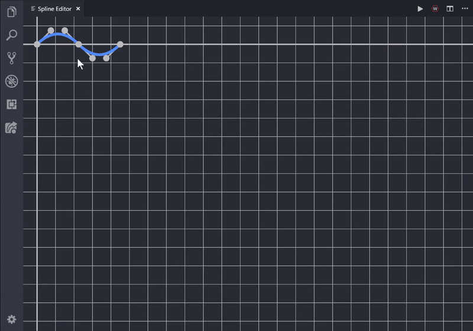
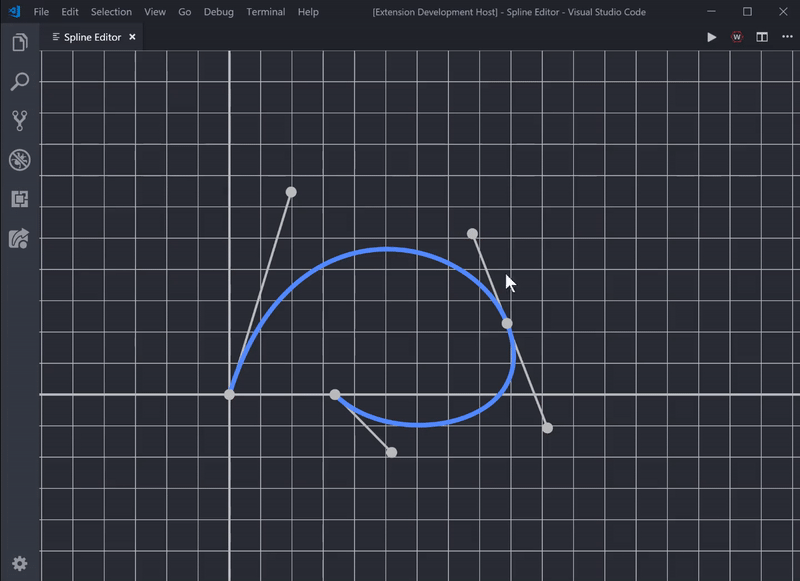

# FRC Spline Creator

Graphical spline creator for FRC team 2848

## How to use

### General
* `Click + Drag` to move any point around
* `Shift + Left-Click` to place new anchor point
* `Shift + Right-Click` to remove point

### Control Point

* `Shift + Click + Drag` to only change length of selected point

### Origin Point

* `Click + Drag` to pan across entire scene
* `Shift + Click + Drag` to move origin independently

## Commands

* `Spline Editor: Launch`
* `Spline Editor: Export as XML`

## Changes

Please see [CHANGELOG.md](CHANGELOG.md)

## Planned Features

* Field Map + Obstacles